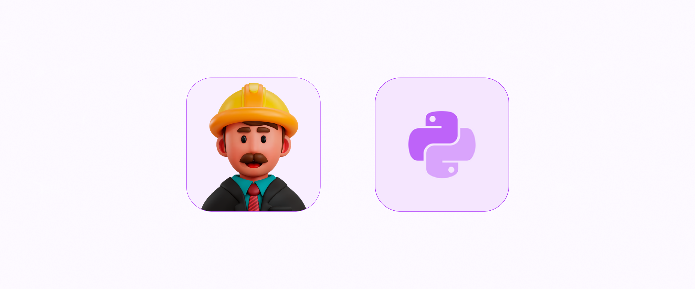

# Foreword

<figure><figcaption></figcaption></figure>

#### About the author 

I am a senior solutions architect at boltcliq with over 13 years of experience in IT, specialising in educational, health, and commerce applications.&#x20;

I am a technical content writer for Redis and a technical consultant who helps businesses create solutions utilising his knowledge in software architecture, systems design, and distributed system design (microservices). I am also a co-founder and lead training specialist of [Top Universe](https://topuniverse.org/), a community dedicated to helping individuals get into tech. To learn more about his business endeavors.

#### Purpose of this book 

The purpose of python for starters is to provide a comprehensive introduction to the Python programming language for people who are new to programming or who have little or no experience with Python.&#x20;

Python For Starters should serve as a beginner guide covering the basics of computer programming and build you up to more advanced concepts, using clear and concise explanations and examples that are easy to understand.

**Some specific goals of Python for Starters include:**

* Teaching the fundamentals of programming, such as variables, data types, loops, and control structures.
* Introducing the Python syntax and the features of the language that are most commonly used.
* Providing practice exercises and challenges to help learners build their skills and confidence.
* Encouraging learners to experiment with code and to develop a problem-solving mindset.
* Helping learners understand how to use Python to build a variety of different types of programs, such as web applications, data analysis tools, or games.
* Overall, the goal of a beginner-friendly Python course is to provide a solid foundation in programming and to give learners the skills and confidence they need to continue learning and growing as developers.

