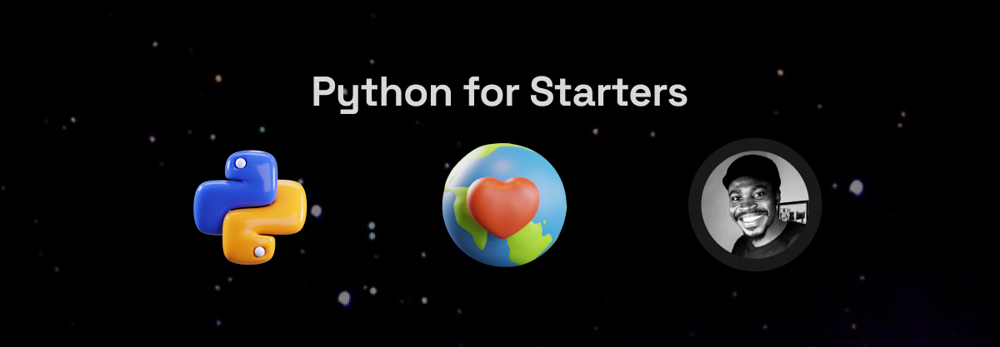

# Introduction to python

<figure><figcaption></figcaption></figure>

#### [What is the Python Programming Language?](broken-reference) 

Python is a high-level, interpreted programming language. It was first released in 1991 and has since become a popular language for web development, data science, and scientific computing. Python is known for its simplicity, readability, and flexibility, making it a great choice for beginners and experienced developers alike. It has a large and active community of users and developers, and a wealth of libraries and frameworks that make it easy to build complex applications quickly.

There are many things that are important to know when learning the Python programming language. Here are a few key points:

* Python is a high-level, interpreted language. This means that it is easy to learn and read, but it may not run as fast as a lower-level language like C or C++.
* Python is dynamically-typed, which means that you don't need to specify the data type of variable when you declare it.
* Python uses indentation to define code blocks, rather than curly braces like many other languages.
* Python has a large standard library, which means that many common programming tasks, such as connecting to a web server or reading and writing files, can be accomplished with minimal code.
* Python has a large and active community, which makes it a great choice for developing open-source projects.
* Python is widely used in scientific computing, data analysis, artificial intelligence, and web development.
* There are two main versions of Python in widespread use today: Python 2 and Python 3. They are similar, but there are a few key differences between the two, so it's important to use the right version for your project.

